# Introduction

Human life is impossible without water, so analysts need to have an idea of its availability in water bodies. The notebook analyzes various types of water bodies: water sources, lakes, rivers and aquifers. 
We will analyze four waterhouses: lake Bilancino, aquifer Petrigano, water spring Lupa and Madonna di Canneto.

TODO добавить про все части наших датасетов и к каждому датасету подвести итог! 

# Lake Bilancino

The following libraries were used.


```python
install.packages(c("lubridate","data.table","aTSA","vars"))
library(data.table)
library(aTSA)
library(vars)
library(lubridate)
```

## Problem definition
Bilancino lake is an artificial lake located in the municipality of Barberino di Mugello (about 50 km from Florence). It is used to refill the Arno river during the summer months. Indeed, during the winter months, the lake is filled up and then, during the summer months, the water of the lake is poured into the Arno river.
Data contains the following features: Rainfall_S_Piero,Rainfall_Mangona, Rainfall_S_Agata, Rainfall_Cavallina, Rainfall_Le_Croci, Temperature_Le_Croci.
Flow_Rate and Lake_Level need to be predicted.

## Data preparations
Let's load the data and take a look at it.


```python
df <- read.csv("/kaggle/input/acea-water-prediction/Lake_Bilancino.csv")
summary(df)
```

You may notice that there are NA's in the data. You can see that they are all the oldest data. To do this, let's make sure that the data is sorted in the correct order (the oldest data is above, the interval is one day) and look at the statistics for the 578 oldest records.


```python
df$Date = strptime(df$Date, "%d/%m/%Y")
df$Date <- ymd(df$Date)

df <- df[order(df$Date), ]
df['Interval']=df$Date - shift(df$Date, n=1, fill=NA, type="lag")
days <- df$Interval

for(i in days)
{
  
  if(isTRUE(i > 1) || is.null(i))
  {
    print(i)
  }
    
}
summary(df[1:578,])
```

We see that first 578 records have are useless for us (no data about rainfall, temperature and missing values for flow rate).
So we don't need them any more.


```python
df <- df[579:6603,]
summary(df)
```

## Stationarity
Since Vector Autoregressive (VAR) Model will be used to predict a group of two variables, it is necessary to provide time series variables with stationarity. But many proponents of the VAR approach recommend that **differencing to induce stationarity should not be done** because the purpose of VAR estimation is purely to examine the relationships between the variables, and that differencing will throw information on any long-run relationships between the series away. Therefore, we will not apply differentiation to ensure stationarity

Let's check stationary and make some transformations (add 1, log). To determine stationarity, we will use augmented Dickey–Fuller test (ADF).


```python
ts_Flow_Rate <- ts(df$Flow_Rate, start=c(2004,2), frequency = 365.25)
plot(ts_Flow_Rate)
adf.test(ts_Flow_Rate)
ts_Flow_Rate <- log(ts(df$Flow_Rate+1, start=c(2004,2), frequency = 365.25))
plot(ts_Flow_Rate)
adf.test(ts_Flow_Rate)
```

Flow_Rate is already stationary, but we will make some transformation, as it further helped to increase the prediction accuracy. Now check Lake_Level.


```python
ts_Lake_Level <- ts(df$Lake_Level, start=c(2004,2), frequency = 365.25)
plot(ts_Lake_Level)
adf.test(ts_Lake_Level)
ts_Lake_Level<-log10(ts_Lake_Level)
plot(ts_Lake_Level)
adf.test(ts_Lake_Level)
```

Some tests were able to overcome the standard design for p-value < 0.05, logarithm does not help, and we will not use differentiation. Let's leave the data as it is.

The remaining variables appear to be stationary.


```python
ts_Rainfall_S_Piero <- ts(df$Rainfall_S_Piero, start=c(2004,2), frequency = 365.25)
plot(ts_Rainfall_S_Piero)
adf.test(ts_Rainfall_S_Piero)
ts_Rainfall_Mangona <- ts(df$Rainfall_Mangona, start=c(2004,2), frequency = 365.25)
plot(ts_Rainfall_Mangona)
adf.test(ts_Rainfall_Mangona)
ts_Rainfall_S_Agata <- ts(df$Rainfall_S_Agata, start=c(2004,2), frequency = 365.25)
plot(ts_Rainfall_S_Agata)
adf.test(ts_Rainfall_S_Agata)
ts_Rainfall_Cavallina <- ts(df$Rainfall_Cavallina, start=c(2004,2), frequency = 365.25)
plot(ts_Rainfall_Cavallina)
adf.test(ts_Rainfall_Cavallina)
ts_Rainfall_Le_Croci <- ts(df$Rainfall_Le_Croci, start=c(2004,2), frequency = 365.25)
plot(ts_Rainfall_Le_Croci)
adf.test(ts_Rainfall_Le_Croci)
ts_Temperature_Le_Croci <- ts(df$Temperature_Le_Croci, start=c(2004,2), frequency = 365.25)
plot(ts_Temperature_Le_Croci)
adf.test(ts_Temperature_Le_Croci)

```

## Models
Next, we will try to train several models on the presented data and compare them with each other on cross-validation.

### Simple model
Let's collect our exogenous and endogenous data in x and y.


```python
y <- cbind(ts_Flow_Rate, ts_Lake_Level)
colnames(y)<-cbind("Flow_Rate", "Lake_Level")

x <- cbind(ts_Rainfall_Cavallina, ts_Rainfall_Le_Croci, ts_Rainfall_Mangona, ts_Rainfall_S_Agata, ts_Rainfall_S_Piero, ts_Temperature_Le_Croci)
colnames(x)<-cbind("Rainfall_Cavallina", "Rainfall_Le_Croci", "Rainfall_Mangona", "Rainfall_S_Agata", "Rainfall_S_Piero", "Temperature_Le_Croci")
```

Now we need to define the p parameter for our model.


```python
lagselect <- VARselect(y=y, type = "const", exogen = x)
lagselect$selection
```

We will use AIC's p=5.<br/>
Prepare some train and test data. Let's make 2 year prediction.


```python
border <- length(y[,1])-2*365
train_y <- y[1:border,]
train_x <- x[1:border,]
test_y <- y[(border+1):length(y[,1]),]
test_x <- x[(border+1):length(y[,1]),]
```

Create model with p=5.


```python
Model1 <- VAR(train_y, p = 5, type = "const",  exogen = train_x)
summary(Model1)
```

P-value, R-squared and F-static are good.

Let's test model and visualize prediction to compare with test data.


```python
pred_y <- predict(Model1, n.ahead =2*365, dumvar=test_x, ci=0.95)
plot(y)
plot(pred_y)
```

Let's make our own function for cross-validation, we will calculate the RMSE. We will make a prediction for 3 days and calculate the error.


```python
cross_val <- function(x, y, p) {
  max <- length(y[,1])
  border <- max-2*365
  pred_length <- 3
  errors_Flow=0
  errors_Level=0
  measures = 0
  while (border+pred_length <= max) {
    train_y <- y[1:border,]
    train_x <- x[1:border,]
    test_y <- y[(border+1):(border+pred_length),]
    test_x <- x[(border+1):(border+pred_length),]
    test_Model <- VAR(train_y, p = p, type = "const",  exogen = train_x)
    pred_y <- predict(test_Model, n.ahead = pred_length, dumvar=test_x, ci=0.95)
    check<-pred_y$fcst$Flow_Rate
    errors_Flow <- sum((check[,1]-test_y[,1])^2)+errors_Flow
    check<-pred_y$fcst$Lake_Level
    errors_Level <- sum((check[,1]-test_y[,2])^2)+errors_Level
    measures=measures + 3
    border=border+pred_length
  }
  RMSE_Flow = sqrt(errors_Flow/measures)
  RMSE_Level = sqrt(errors_Level/measures)
  c(RMSE_Flow,RMSE_Level)
}
```

Our results for Flow_Rate and Lake_Level


```python
p=5
cross_val(x,y,p)
```

### Delayed model
Flow_Rate and Lake_Level are feature dependent with some latency. Let's move x forward 1 day to get the dependence of the next day's output variables on the current values.


```python
y_1 <- cbind(ts_Flow_Rate, ts_Lake_Level)
colnames(y_1)<-cbind("Flow_Rate", "Lake_Level")

x_1 <- cbind(shift(ts_Rainfall_Cavallina), shift(ts_Rainfall_Le_Croci), shift(ts_Rainfall_Mangona), shift(ts_Rainfall_S_Agata), shift(ts_Rainfall_S_Piero), shift(ts_Temperature_Le_Croci))
colnames(x_1)<-cbind("Rainfall_Cavallina", "Rainfall_Le_Croci", "Rainfall_Mangona", "Rainfall_S_Agata", "Rainfall_S_Piero", "Temperature_Le_Croci")
```

Further actions are similar, only the p parameter and data boundaries will differ (the first record contains NA and does not suit us).


```python
lagselect <- VARselect(y=y_1, type = "const", exogen = x_1)
lagselect$selection

train_y <- y_1[2:border,]
train_x <- x_1[2:border,]
test_y <- y_1[(border+1):length(y_1[,1]),]
test_x <- x_1[(border+1):length(y_1[,1]),]

Model2 <- VAR(train_y, p = 6, type = "const",  exogen = train_x)
summary(Model2)

pred_y <- predict(Model2, n.ahead =2*365, dumvar=test_x, ci=0.95)

plot(y_1)
plot(pred_y)
```

And cross-validation.


```python
cross_val_1 <- function(x, y, p) {
  max <- length(y[,1])
  border <- max-2*365
  pred_length <- 3
  errors_Flow=0
  errors_Level=0
  measures = 0
  while (border+pred_length <= max) {
    train_y <- y[2:border,]
    train_x <- x[2:border,]
    test_y <- y[(border+1):(border+pred_length),]
    test_x <- x[(border+1):(border+pred_length),]
    test_Model <- VAR(train_y, p = p, type = "const",  exogen = train_x)
    pred_y <- predict(test_Model, n.ahead = pred_length, dumvar=test_x, ci=0.95)
    check<-pred_y$fcst$Flow_Rate
    errors_Flow <- sum((check[,1]-test_y[,1])^2)+errors_Flow
    check<-pred_y$fcst$Lake_Level
    errors_Level <- sum((check[,1]-test_y[,2])^2)+errors_Level
    measures=measures + 3
    border=border+pred_length
  }
  RMSE_Flow = sqrt(errors_Flow/measures)
  RMSE_Level = sqrt(errors_Level/measures)
  c(RMSE_Flow,RMSE_Level)
}

p=6
cross_val_1(x_1,y_1,p)
```

Looks better.

## Delayedx2 model
Let's take one more step into the future. All steps are repeated, only now the model predicts y two days.


```python
y_2 <- cbind(ts_Flow_Rate, ts_Lake_Level)
colnames(y_2)<-cbind("Flow_Rate", "Lake_Level")

x_2 <- cbind(shift(ts_Rainfall_Cavallina, n=2L), shift(ts_Rainfall_Le_Croci, n=2L), shift(ts_Rainfall_Mangona, n=2L), shift(ts_Rainfall_S_Agata, n=2L), shift(ts_Rainfall_S_Piero, n=2L), shift(ts_Temperature_Le_Croci, n=2L))
colnames(x_2)<-cbind("Rainfall_Cavallina", "Rainfall_Le_Croci", "Rainfall_Mangona", "Rainfall_S_Agata", "Rainfall_S_Piero", "Temperature_Le_Croci")

lagselect <- VARselect(y=y_2, type = "const", exogen = x_2)
lagselect$selection

train_y <- y_2[3:border,]
train_x <- x_2[3:border,]
test_y <- y_2[(border+1):length(y_2[,1]),]
test_x <- x_2[(border+1):length(y_2[,1]),]
```


```python
Model3 <- VAR(train_y, p = 5, type = "const",  exogen = train_x)
summary(Model3)

pred_y <- predict(Model3, n.ahead =2*365, dumvar=test_x, ci=0.95)

plot(y_2)
plot(pred_y)
```

And cross-validation.


```python
cross_val_2 <- function(x, y, p) {
  max <- length(y[,1])
  border <- max-2*365
  pred_length <- 3
  errors_Flow=0
  errors_Level=0
  measures = 0
  while (border+pred_length <= max) {
    train_y <- y[3:border,]
    train_x <- x[3:border,]
    test_y <- y[(border+1):(border+pred_length),]
    test_x <- x[(border+1):(border+pred_length),]
    test_Model <- VAR(train_y, p = p, type = "const",  exogen = train_x)
    pred_y <- predict(test_Model, n.ahead = pred_length, dumvar=test_x, ci=0.95)
    check<-pred_y$fcst$Flow_Rate
    errors_Flow <- sum((check[,1]-test_y[,1])^2)+errors_Flow
    check<-pred_y$fcst$Lake_Level
    errors_Level <- sum((check[,1]-test_y[,2])^2)+errors_Level
    measures=measures + 3
    border=border+pred_length
  }
  RMSE_Flow = sqrt(errors_Flow/measures)
  RMSE_Level = sqrt(errors_Level/measures)
  c(RMSE_Flow,RMSE_Level)
}

p=6
cross_val_2(x_2,y_2,p)
```

The previous performance was better. This means that we need to change tactics. Moreover, a further increase in the delay does not make sense, since none of the existing models is precisely able to determine the weather for more than 3 days.

 ### Combine previous models
As we see in VAR model formula:
> Flow_Rate = Flow_Rate.l1 + Lake_Level.l1 + Flow_Rate.l2 + Lake_Level.l2 + Flow_Rate.l3 + Lake_Level.l3 + Flow_Rate.l4 + Lake_Level.l4 + Flow_Rate.l5 + Lake_Level.l5 + const + Rainfall_Cavallina + Rainfall_Le_Croci + Rainfall_Mangona + Rainfall_S_Agata + Rainfall_S_Piero + Temperature_Le_Croci

The output variables in the model depend only on the current x in the same data line, but the dependence must be made up of several previous values.

Let's combine features with them, but shifted forward by 1 and 2 days. This will give us the necessary summation of the effect.


```python
y_3 <- cbind(ts_Flow_Rate, ts_Lake_Level)
colnames(y_3)<-cbind("Flow_Rate", "Lake_Level")

x_3 <- cbind(ts_Rainfall_Cavallina, ts_Rainfall_Le_Croci, ts_Rainfall_Mangona, ts_Rainfall_S_Agata, ts_Rainfall_S_Piero, ts_Temperature_Le_Croci, shift(ts_Rainfall_Cavallina), shift(ts_Rainfall_Le_Croci), shift(ts_Rainfall_Mangona), shift(ts_Rainfall_S_Agata), shift(ts_Rainfall_S_Piero),shift(ts_Temperature_Le_Croci),shift(ts_Rainfall_Cavallina, n=2L), shift(ts_Rainfall_Le_Croci, n=2L), shift(ts_Rainfall_Mangona, n=2L), shift(ts_Rainfall_S_Agata, n=2L), shift(ts_Rainfall_S_Piero, n=2L),shift(ts_Temperature_Le_Croci, n=2L))
colnames(x_3)<-cbind("Rainfall_Cavallina", "Rainfall_Le_Croci", "Rainfall_Mangona", "Rainfall_S_Agata", "Rainfall_S_Piero", "Temperature_Le_Croci","Rainfall_Cavallina_1", "Rainfall_Le_Croci_1", "Rainfall_Mangona_1", "Rainfall_S_Agata_1", "Rainfall_S_Piero_1","Temperature_Le_Croci_1","Rainfall_Cavallina_2", "Rainfall_Le_Croci_2", "Rainfall_Mangona_2", "Rainfall_S_Agata_2", "Rainfall_S_Piero_2","Temperature_Le_Croci_2")

lagselect <- VARselect(y=y_3, type = "const", exogen = x_3)
lagselect$selection

train_y <- y_3[3:border,]
train_x <- x_3[3:border,]
test_y <- y_3[(border+1):length(y_3[,1]),]
test_x <- x_3[(border+1):length(y_3[,1]),]
```


```python
Model4 <- VAR(train_y, p = 6, type = "const",  exogen = train_x)
summary(Model4)

pred_y <- predict(Model4, n.ahead =2*365, dumvar=test_x, ci=0.95)

plot(y_3)
plot(pred_y)
```

Let's see what cross-validation tells us.


```python
cross_val_3 <- function(x, y, p) {
  max <- length(y[,1])
  border <- max-2*365
  pred_length <- 3
  errors_Flow=0
  errors_Level=0
  measures = 0
  while (border+pred_length <= max) {
    train_y <- y[3:border,]
    train_x <- x[3:border,]
    test_y <- y[(border+1):(border+pred_length),]
    test_x <- x[(border+1):(border+pred_length),]
    test_Model <- VAR(train_y, p = p, type = "const",  exogen = train_x)
    pred_y <- predict(test_Model, n.ahead = pred_length, dumvar=test_x, ci=0.95)
    check<-pred_y$fcst$Flow_Rate
    errors_Flow <- sum((check[,1]-test_y[,1])^2)+errors_Flow
    check<-pred_y$fcst$Lake_Level
    errors_Level <- sum((check[,1]-test_y[,2])^2)+errors_Level
    measures=measures + 3
    border=border+pred_length
  }
  RMSE_Flow = sqrt(errors_Flow/measures)
  RMSE_Level = sqrt(errors_Level/measures)
  c(RMSE_Flow,RMSE_Level)
}

p=6
cross_val_3(x_3,y_3,p)
```

These indicators are better than all the previous ones. Therefore, we will leave this version of the developed model.

In order for this model to be comparable with other models in which the data could be transformed differently, we will slightly alter the function for calculating the RMSE, first transforming the output values back to the original form (except for the added 1, which is canceled out when the test data is subtracted from predicted value). We also leave here the formula for the inverse transformation:


```python
# Pred_Flow_Rate <- e^pred_y$fcst$Flow_Rate[,1]-1
# Pred_Lake_Level <- 10^pred_y$fcst$Lake_Level[,1]

cross_val_4 <- function(x, y, p) {
  max <- length(y[,1])
  border <- max-2*365
  pred_length <- 3
  errors_Flow=0
  errors_Level=0
  measures = 0
  while (border+pred_length <= max) {
    train_y <- y[3:border,]
    train_x <- x[3:border,]
    test_y <- y[(border+1):(border+pred_length),]
    test_x <- x[(border+1):(border+pred_length),]
    test_Model <- VAR(train_y, p = p, type = "const",  exogen = train_x)
    pred_y <- predict(test_Model, n.ahead = pred_length, dumvar=test_x, ci=0.95)
    check<-pred_y$fcst$Flow_Rate
    errors_Flow <- sum((exp(check[,1])-exp(test_y[,1]))^2)+errors_Flow
    check<-pred_y$fcst$Lake_Level
    errors_Level <- sum((10^check[,1]-10^test_y[,2])^2)+errors_Level
    measures=measures + 3
    border=border+pred_length
  }
  RMSE_Flow = sqrt(errors_Flow/measures)
  RMSE_Level = sqrt(errors_Level/measures)
  c(RMSE_Flow,RMSE_Level)
}

cross_val_4(x_3,y_3,p)
```

RMSE_Flow_Rate = 2.26697309092565 <br/>
RMSE_Level = 0.121072372651214

## Conclusion
Thus, the following steps were taken to build the models and to choose the best one (steps 5-8 repeated for each model):
1. Sort by date and check that the time interval is 1 day
2. Removed useless data from the beginning of the dataset
3. Checking data for stationarity
4. Transformation
5. Fitting a model parameter
6. Preparing the model and checking its parameters (p-value, F-static, R-square)
7. Creation of test and training sets; prediction
8. Cross-validation; comparison of models

# Petrigano aquifer

### Description
 The wells field of the alluvial plain between Ospedalicchio di Bastia Umbra and Petrignano is fed by three underground aquifers separated by low permeability septa. The aquifer can be considered a water table groundwater and is also fed by the Chiascio river. The groundwater levels are influenced by the following parameters: rainfall, depth to groundwater, temperatures and drainage volumes, level of the Chiascio river.

## Data preparation


```python
```
df <- as.data.frame(read.table('/kaggle/input/acea-water-prediction/Aquifer_Petrignano.csv', header = TRUE, sep=','))
head(df, n=20)
```
```

```
df <- as.data.frame(read.table('/kaggle/input/acea-water-prediction/Aquifer_Petrignano.csv', header = TRUE, sep=','))
head(df, n=20)
```

### Remove NA elements from data 

```
df <- df[complete.cases(df$Rainfall_Bastia_Umbra),]
rownames(df) <- 1:nrow(df)
df <- subset(df, select = -c(Depth_to_Groundwater_P25, Temperature_Petrignano ))
colnames(df) <- c("Date", "Rainfall", "Depth_to_Groundwater","Temperature", " Volume", " Hydrometry" )
head(df, n=20)
```

### load libs

```
library('ggplot2')
library('forecast')
library('zoo')
library('dplyr')
library('data.table')
library('imputeTS')
library('xts')
library('tseries')
library('stats')
library('nlme')
library('fpp')
library('lubridate')
library('TSstudio')
library('AICcmodavg')
```

### Make chronological order

```
df$Date <- as.Date(df$Date, format= "%d/%m/%Y")
df <- df[order(df$Date), ]
interval = df$Date - shift(df$Date, n=1, fill=NA, type="lag")
for(i in interval)
{
  
  if(isTRUE(i > 1) || is.null(i))
  {
    print(i)
  }
    
}
```

### As we can see, there are some missing values that we need to fix. We can see it from stat and from graphics where red places or outliers.

```
# find that there are some missing values in data set
ggplot_na_distribution(df$Depth_to_Groundwater)
ggplot_na_distribution(df$Rainfall)
ggplot_na_distribution(df$Temperature)
ggplot_na_distribution(df$` Volume`)
ggplot_na_distribution(df$` Hydrometry`)
statsNA(df$Depth_to_Groundwater)
statsNA(df$Rainfall)
statsNA(df$Temperature)
statsNA(df$` Volume`)
statsNA(df$` Hydrometry`)
```


### Interpolate data to fix missing values

```
times_dd <- ts(df$Depth_to_Groundwater, start = df$Date[1], frequency=1)
ggplot_na_distribution(times_dd)
times_dd <- na_interpolation(times_dd, option="spline")
```


### After interpolation

```
ggplot_na_distribution(times_dd)
plot( times_dd,xlab = "Time", ylab = "Depth_to_Groundwater", main="Depth", axes=FALSE, type="l")
axis(1,at=seq(df$Date[1], df$Date[length(df$Date)], by="years"),labels=unique(as.character(df$Date, format= "%Y")))
axis(2)
box()
```

### Volume has some troubles

```
df$` Volume` <- ifelse(df$` Volume` == 0, NaN, df$` Volume`)
times_vv <- ts(df$` Volume`, start = df$Date[1], frequency=1)
ggplot_na_distribution(times_vv)
times_vv <- na_interpolation(times_vv, option="linear")
ggplot_na_distribution(times_vv)
plot( times_vv,xlab = "Time", ylab = "Volume", main="Volume", axes=FALSE, type="l")
axis(1,at=seq(df$Date[1], df$Date[length(df$Date)], by="years"),labels=unique(as.character(df$Date, format= "%Y")))
axis(2)
box()
```

### Interpolation can't be realised due to there are no missing values, there are only 0 values, that are anomaly for for current data. So we can change 0 to nan and then interpolate

```
df$` Hydrometry` <- ifelse(df$` Hydrometry` == 0, NaN, df$` Hydrometry`)
times_hh <- ts(df$` Hydrometry`, start = df$Date[1], frequency=1)
ggplot_na_distribution(times_hh)
times_hh <- na_interpolation(times_hh, option="linear")
ggplot_na_distribution(times_hh)
plot( times_hh,xlab = "Time", ylab = "Hydrometry", main="Hydrometry", axes=FALSE, type="l")
axis(1,at=seq(df$Date[1], df$Date[length(df$Date)], by="years"),labels=unique(as.character(df$Date, format= "%Y")))
axis(2)
box()
```

### Resampling
the series can be assembled unevenly over time and to eliminate this resampling is used
So if data was collected once an hour, and then suddenly once a day, and then once every 3 hours we will make it at equal intervals. But there we haven't got any troubles that was checd by counting interval higher

### For depth

```
times_dd <- ts(df$Depth_to_Groundwater, start = df$Date[1], frequency=1)
times_dd <- na_interpolation(times_dd, option="spline")
time_dd_week <- period.apply(as.xts(times_dd), endpoints(as.xts(times_dd), "weeks"), range)
times_dd <- na_interpolation(time_dd_week, option="spline")
plot( time_dd_week,xlab = "Time", ylab = "Depth_to_Groundwater", main="Depth", axes=FALSE, type="l")
axis(1,at=seq(df$Date[1], df$Date[length(df$Date)], by="years"),labels=unique(as.character(df$Date, format= "%Y")))
axis(2)
box()
```


### For temparature

```
times_t <- ts(df$Temperature, start = df$Date[1], frequency=1)
times_tt_week <- period.apply(as.xts(times_t), endpoints(as.xts(times_t), "weeks"), range)
plot( times_tt_week,xlab = "Time", ylab = "Temperature", main="Temperature", axes=FALSE, type="l")
axis(1,at=seq(df$Date[1], df$Date[length(df$Date)], by="years"),labels=unique(as.character(df$Date, format= "%Y")))
axis(2)
box()
```

### For volume

```
times_vv <- ts(df$` Volume`, start = df$Date[1], frequency=1)
times_vv_week <- period.apply(as.xts(times_vv), endpoints(as.xts(times_vv), "weeks"), range)
times_vv_week <- na_interpolation(times_vv_week, option="linear")
plot( times_vv_week,xlab = "Time", ylab = "Volume", main="Volume", axes=FALSE, type="l")
axis(1,at=seq(df$Date[1], df$Date[length(df$Date)], by="years"),labels=unique(as.character(df$Date, format= "%Y")))
axis(2)
box()
```

### For hydrometry

```
times_hh <- ts(df$` Hydrometry`, start = df$Date[1], frequency=1)
times_hh_week <- period.apply(as.xts(times_hh), endpoints(as.xts(times_hh), "weeks"), range)
times_hh_week <- na_interpolation(times_hh_week, option="linear")
plot( times_hh_week,xlab = "Time", ylab = "Hydrometry", main="Hydrometry", axes=FALSE, type="l")
axis(1,at=seq(df$Date[1], df$Date[length(df$Date)], by="years"),labels=unique(as.character(df$Date, format= "%Y")))
axis(2)
box()
```

### For rainfall

```
times <- ts(df$Rainfall, start = df$Date[1], frequency=1)
times_week <- period.apply(as.xts(times), endpoints(as.xts(times), "weeks"), range)
plot( times_week,xlab = "Time", ylab = "Rainfall", main="Rainfall", axes=FALSE)
axis(1,at=seq(df$Date[1], df$Date[length(df$Date)], by="years"),labels=unique(as.character(df$Date, format= "%Y")))
axis(2)
box()
```


We can say that it is not obvious to resample data, we can make predictions for one day and it will be quite accurate and full. If we will take for day or month we can lose some info that will be critical for people' life. Also there is no such big outliers that require smoothing

## Analyse data 

```
depth <- na_interpolation(df$Depth_to_Groundwater, option = "linear")
depth_ts <- ts(depth, start = df$Date[1], frequency=365)
```

### look at seasonal, because we can make some decisions from the seasonalty.

```
ts_seasonal(ts(na_interpolation(df$Depth_to_Groundwater, option = "linear"), start = df$Date[1], frequency=12), type = "all")
ts_plot(depth_ts)
```

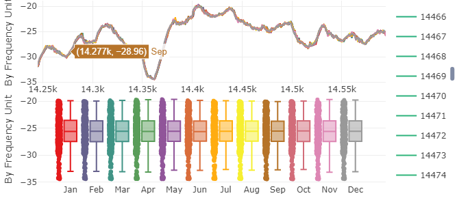


```
rainfall <- na_interpolation(df$Rainfall, option = "linear")
rainfall_ts <- ts(rainfall, start = df$Date[1], frequency=12)
rainfall_ts <- diff(rainfall_ts)
ts_seasonal(rainfall_ts, type = "all")
```
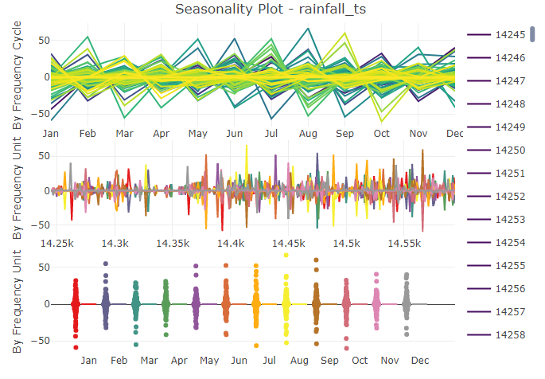

```
temperature <- na_interpolation(df$Temperature, option = "linear")
temperature_ts <- ts(temperature, start = df$Date[1], frequency=12)
temperature_ts <- diff(temperature_ts)
ts_seasonal(temperature_ts, type = "all")
```
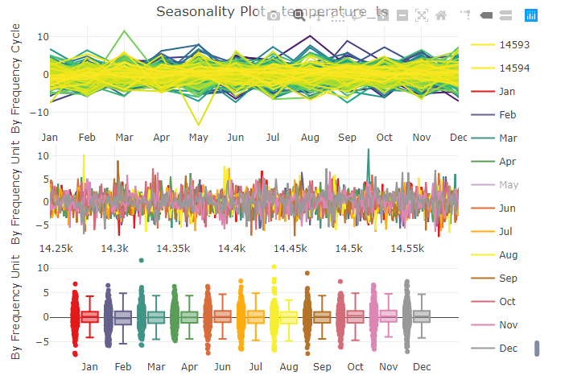
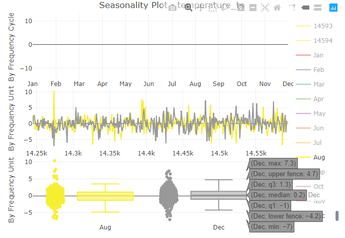

### From the plot we can see that the maximum temperature was in August, minimum in December

```
volume <- na_interpolation(df$` Volume`, option = "linear")
volume_ts <- ts(volume, start = df$Date[1], frequency=12)
volume_ts <- diff(volume_ts)
ts_seasonal(volume_ts, type = "all")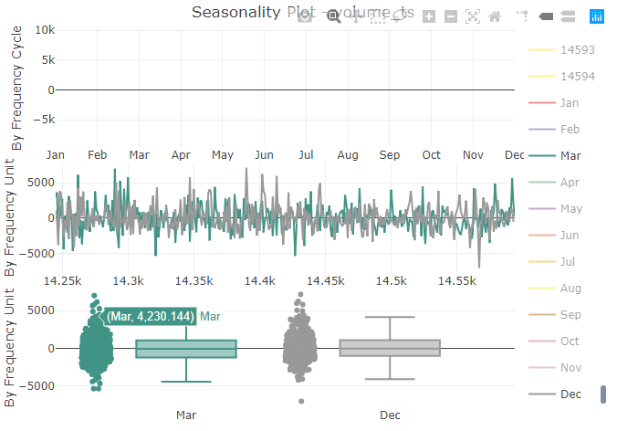
```


### Maximum volume was in March, minimum in December

```
hydrometry <- na_interpolation(df$` Hydrometry`, option = "linear")
hydrometry_ts <- ts(hydrometry, start = df$Date[1], frequency=12)
hydrometry_ts <- diff(hydrometry_ts)
ts_seasonal(hydrometry_ts, type = "all")
```
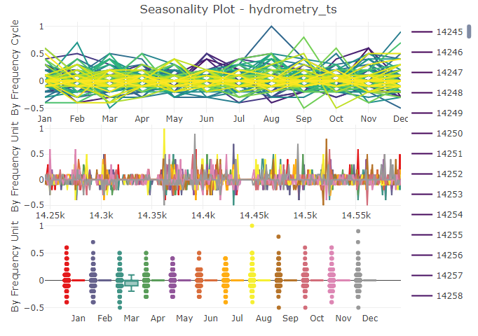
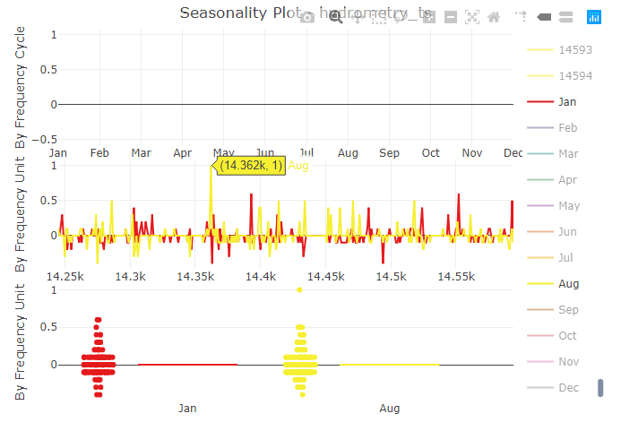

### Maximum in August, minimum in January.

### The volume and hydrometry reached their minimum around the same time

## Use ARIMA 

In time series we should work with stationary data, where time intervals are constant and all data in chronological order. It is the reason why we have done such preporations with data. 
To get so we have done:
- Deleted year seasonalty ```mean = np.mean(train_without_seasonal)```
- Delete week seasonalty ```decomposition = seasonal_decompose(train, period=365)```
- There is no heteroscedasticity and we raise time series at the zero level ```decomposition = seasonal_decompose(train_without_seasonal, period=7)```

After that we got the best model ARIMA by AIC and BIC.
After that we tested ts forecasting at the part of the data
Then forecasted ts (+ recovery it with seasonality )  and predict for real data 

Get best model choosing the least AIC, BIC value
```
from warnings import filterwarnings
filterwarnings('ignore')
for p_ in range(p, -1, -1):
    for q_ in range(q, -1, -1):
        try:
            print(f'(p, d, q) = ({p_}, {d}, {q_})')
            m = SARIMAX(train_data, order=(p_, d, q_)).fit()
            if (m.aic <= best_aic):
                print(f'Now best is ({p_}, {d}, {q_})')
                best_aic, model = m.aic, m
        except Exception as e:
            pass
```

Chosen model
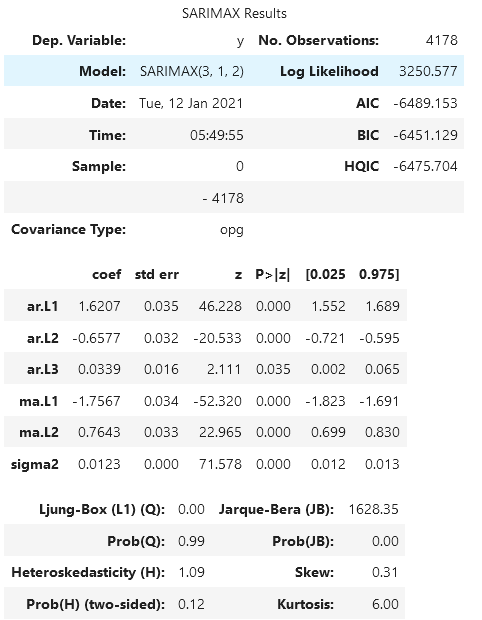

Check autocorrelations. Everything is okey, residuals are normal distributed
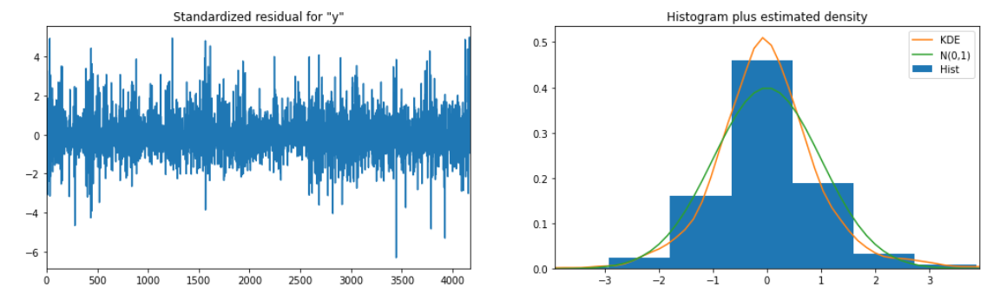

### Recovery ts with seosanality
```
forecast = model.forecast(steps=to_forecast)
forecast = forecast.apply(lambda x: x + mean)
plt.plot(w_seasonal.values[:40])
for i in range(7):
plt.plot(y_seasonal.values[:1000])
for i in range(365):
    if y_seasonal[i] == y_seasonal[-1]:
        print(i)
    if w_seasonal[i] == w_seasonal[-1]:
        print(i)
w_seasonal_range = w_seasonal.values[6:6+7]
w_seasonal_forecast = np.array([
    w_seasonal_range[i % 7] for i in range(to_forecast)
])
w_seasonal_forecast
forecast += w_seasonal_forecast
plt.plot(y_seasonal.values[:1000])
for i in range(365):
    if y_seasonal[i] == y_seasonal[-1]:
        print(i)
y_seasonal_range = y_seasonal.values[163:163+365]
y_seasonal_forecast = np.array([
    y_seasonal_range[i % 365] for i in range(to_forecast)
])
y_seasonal_forecast
forecast += y_seasonal_forecast

```

## Forecasted result time series
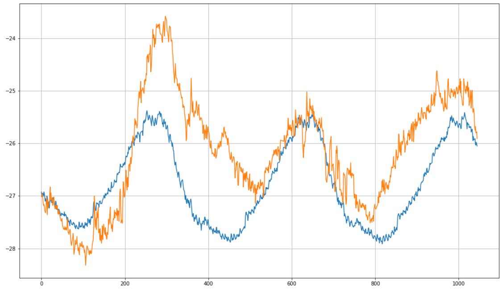

## Forecasted data
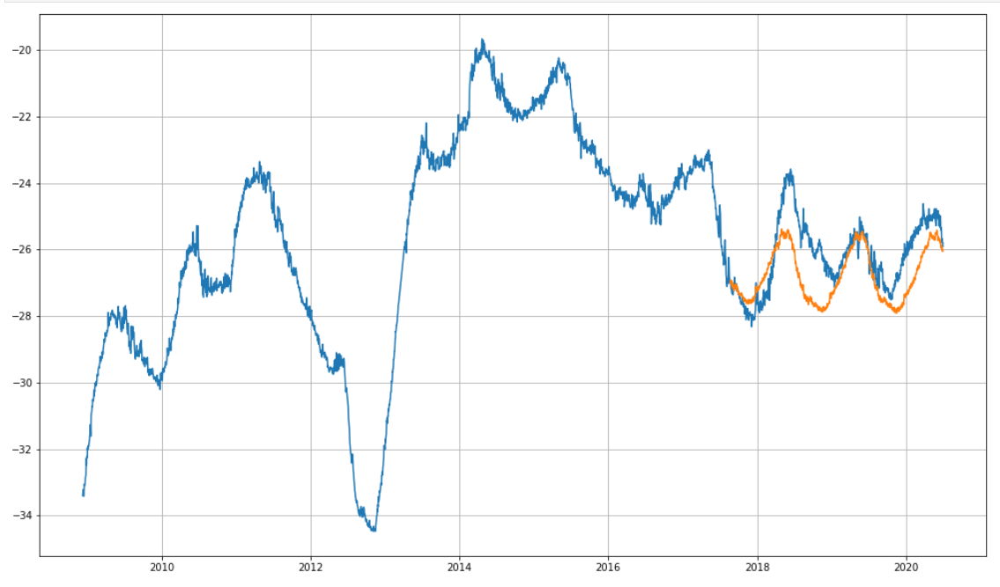

It is not ideal but quite good because trend can't be analytically closed and we deleted it by difference.
