# Acea-Smart-Water-Analytics
Project for Data science exam.

## Выполнили:
Студенты:
- Волянский Юлиан, группа Б17-565
- Худоярова Анастасия, группа Б17-505
- Шарафиев Родион, группа Б17-503

## Описание работы
Жизнь человека невозможна без воды, поэтому аналитикам необходимо иметь представление о её доступности в водоёмах. В работе анализируются различные типы водных объектов: водные источники, озера, реки и водоносные горизонты.
Всего представлено 9 водоемов, то есть наборов данных.  
Задача состоит в том, чтобы для каждого водоёма понять, что влияет на его водообеспеченность. Необходимо понять, как в течение года меняется его объем. 
Временной интервал выбирается в зависимости от того, на каком интервале дается модель, то есть ежедневный, месячный или годовой, для каждого набора отдельно. 
Желаемый результат: построение математических моделей, которые прогнозируют параметры, что указаны на картинке:

Представлены 3 родника, 1 озеро, 1 река, 4 водоносных слоя. Для каждого набора надо построить свою модель.  
Более подробно на изображении:
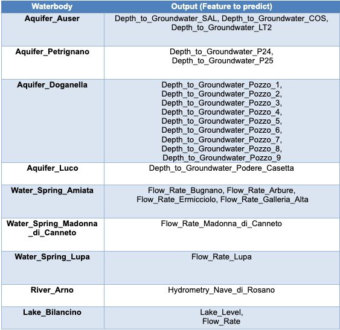

## Этапы работы
Были выделены следующие общие этапы работы:
1. Подготовка данных: с помощью интерполяции и логистической регрессии убраны NaN значения и восстановлены пропущенные; сортировка данных в хронологическом порядке; проверка,что данные распределены через одинаковые промежутки (восстанавливается и дополняется методами выше).
2. Получения трендов, сезонности всех характеристик.
3. Общий анализ и выявление общих закономерностей и особенностей.
4. Проверка прогнозируемых характеристик с помощью теста Дики-Фуллера.
5. Преобразование данных в случае необходимости с помощью логарифмирования или взятия разности значений.
6. По графикам ACF, PACF определяются возможные значения p,q. d устанавливается, исходя из того использовалась ли разность и какая. Также значение q, полученное из графика PACF можно заменить смещением, полученным в ADF тесте, что является более точным вариантом. 
7. Строятся возможные модели ARIMA или VAR.  
Для ARIMA: Из полученных моделей по оценкам остатков модели (то есть чтобы автокорреляция на графиках ACF, PACF во всех точках была равна 0) выбирается наиболее подходящая.
8. Производится тестирование модели и валидация с помощью кросс валидации и доверительного интервала.

## Реализовано
### Petrigano
1. Обработка данных.  
Интерполяция пропущенных значений в параметре depth.  
Пропущенные значения

Дополненные:
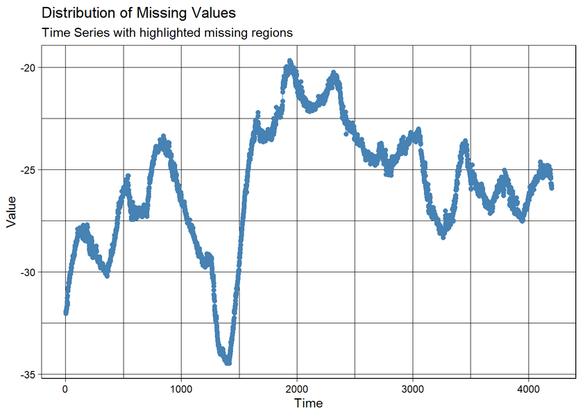
Для volume:
Пропущенные 
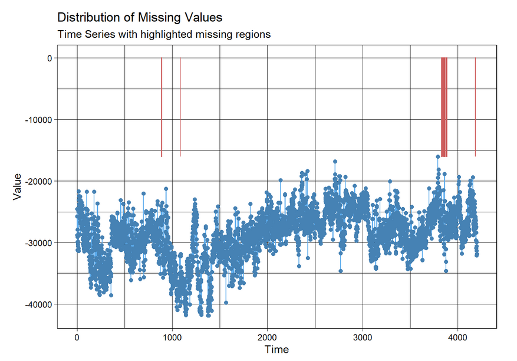
Дополненные:

Для hydrometry:
Пропущенные:
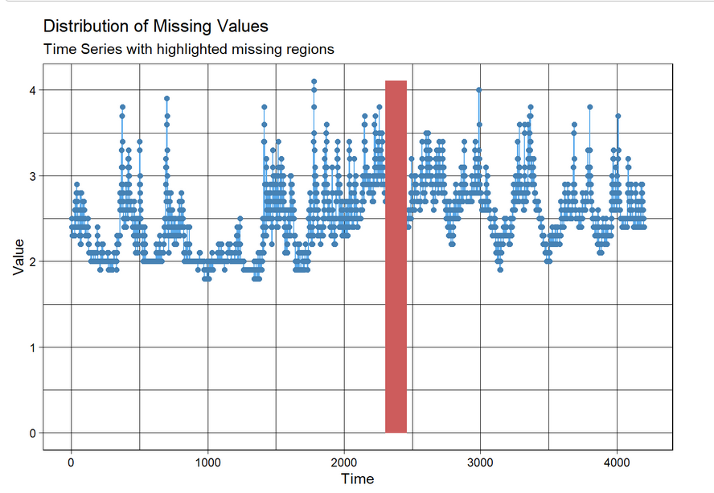
Исправленные:
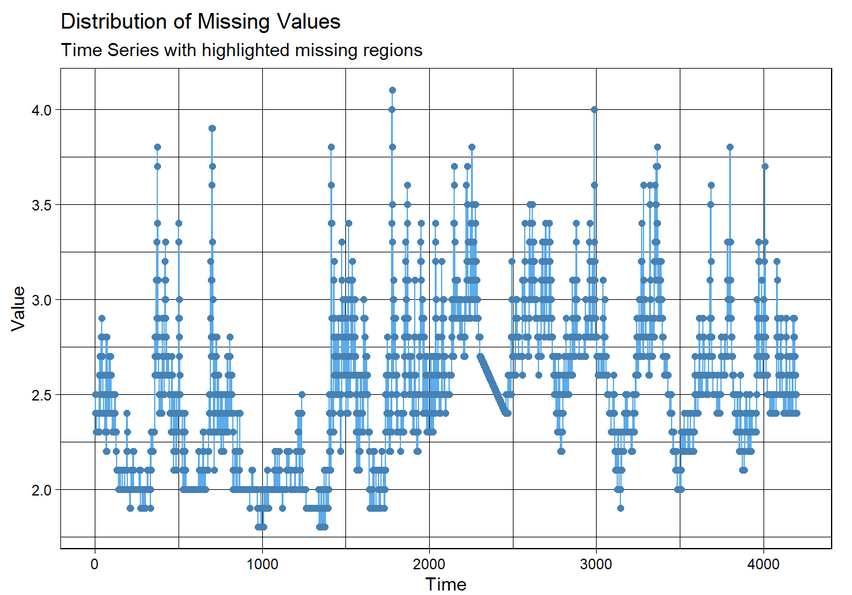
Так же проверка на пропущенные значения выполнена для temperature, rainfall, но для данных параметров данные являются полными.
2. Проверка, что подход прогнозирования на 1 день верный:
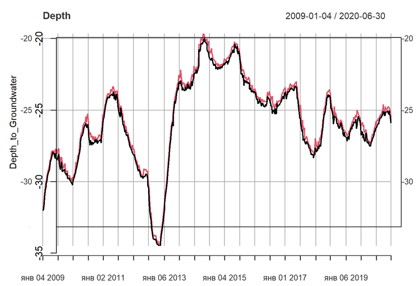
Видим, что никаких аномальных выбросов нет, поэтому нет смысла перегруппировывать. Так же сделано для параметров rainfall, volume, hyrometry, temperature.
3. Проверка данных на стационарность 
Видим, что значение p-value больше 0,05, поэтому требуются преобразования.
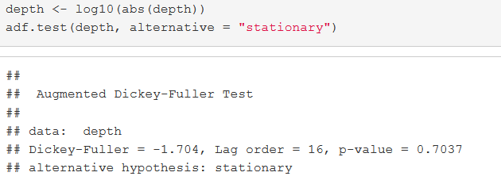
Проверка была выполнена для всех параметров, но представлено только для одного, так как именно его мы будем прогнозировать, что требуется по ТЗ, а в таком случаем однозначно необходимо работать только со стационарными данными.
4. Приведение данных к нужному виду 
С помощью diff получаем нужные данные
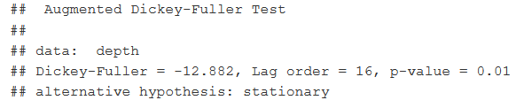
5. Проверка тренда, что отсутствует постоянное или продолжительно увеличение или уменьшение значений. Так же получена сезонность
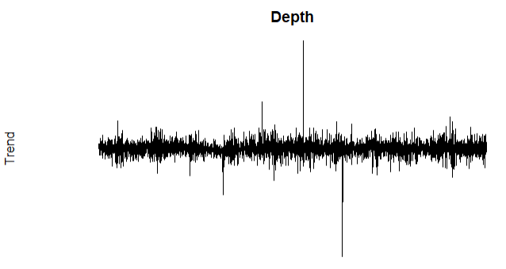
6. Подбор параметров для ARIMA с помощью ACF, PACF.
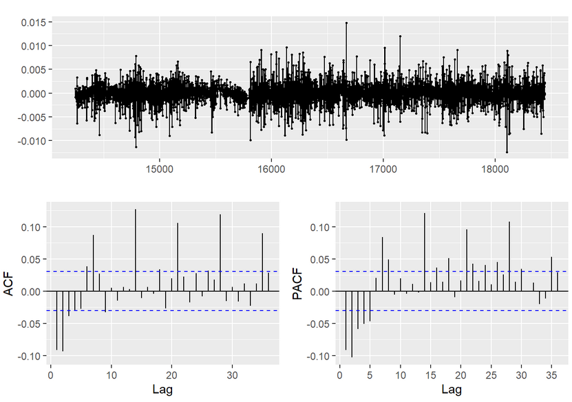
Примерно прикидываем, что значения равны p могут быть равны 13,14, а значение q равно 16, что берём из ADF. 
7. Подбор модели и оценка остатков   
Выбираем наиболее качественную модель, проверяем с помощью оценки остатков модели 
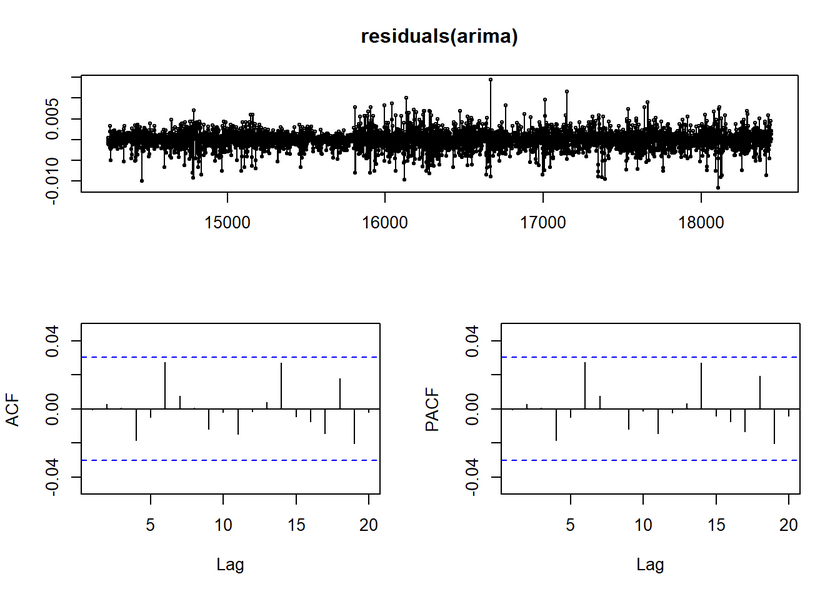
8. Предсказание 
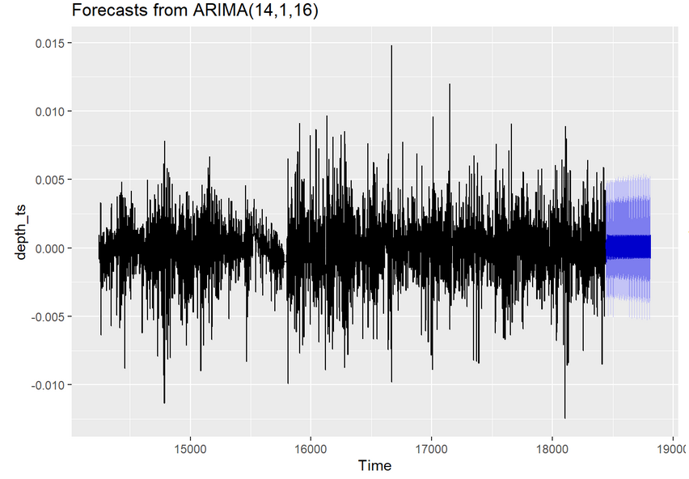
Проверка, что остатки являются белым шумом
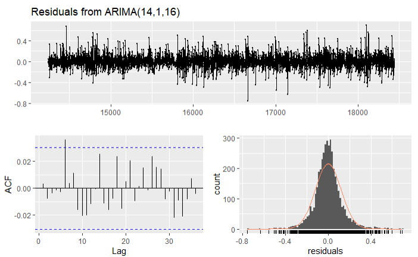
9. Тестирование 
Проверяем, что наше предсказанное значение попадает в доверительный интервал (ограничено серой зоной)
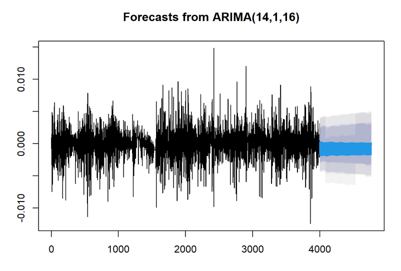

### Lupa
1. Обработка данных
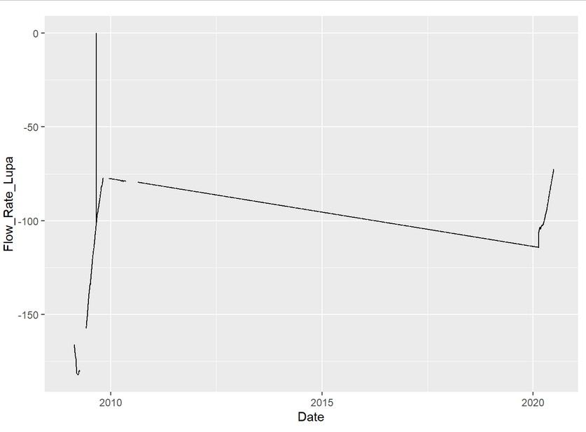

2. Разделение данных для обучающей и тестовой выборки

3. Восстановление данных с помощью логистической регрессии

4. Восстановление данных с помощью интерполяции

5. Проверка на стационарность
Видим, что прогнозируемые данные не подходят

6. Приведение к нужному виду с помощью логарифма и квадратного корня.
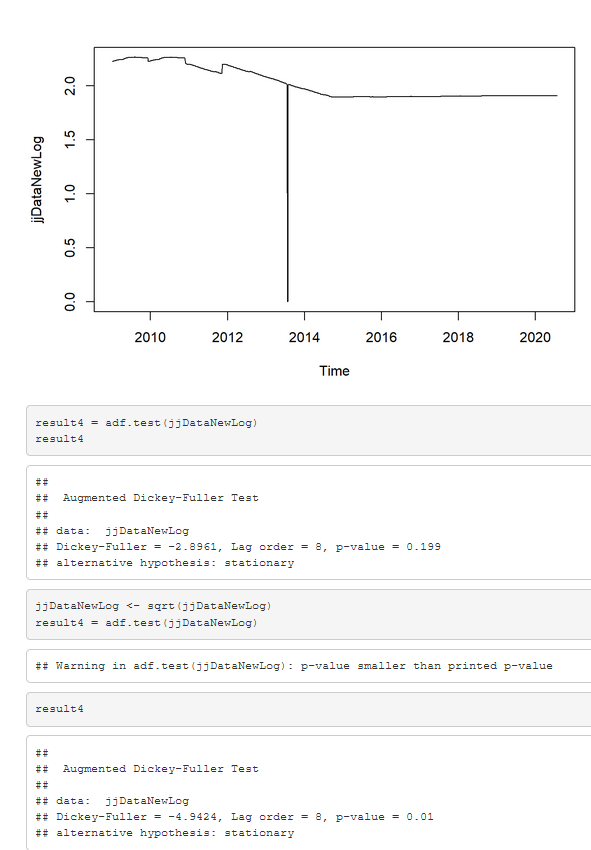
7. Подбор параметров для ARIMA с помощью ACF, PACF.

8. Проверка, что остатки являются белым шумом
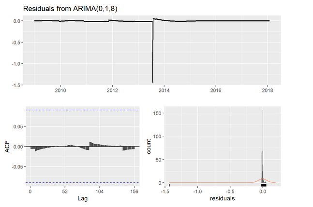
9. Предсказание

10. Подтверждение качества модели

11. Кросс валидация

### Bilancio
1. Подготовка данных

2. Проверка данных на стационарность
Выполнено для всех параметров Flow_Rate, level, Rainfall_S_Piero,Rainfall_Mangona, Rainfall_S_Agata, Rainfall_Cavallina, Rainfall_Le_Croci, Temperature_Le_Croci,  но приводить данные к нужному виду нужно только одну характеристику level

3. Приведение данных к нужному виду
